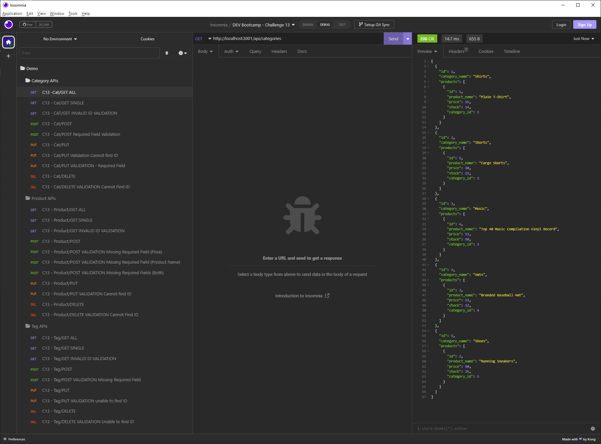
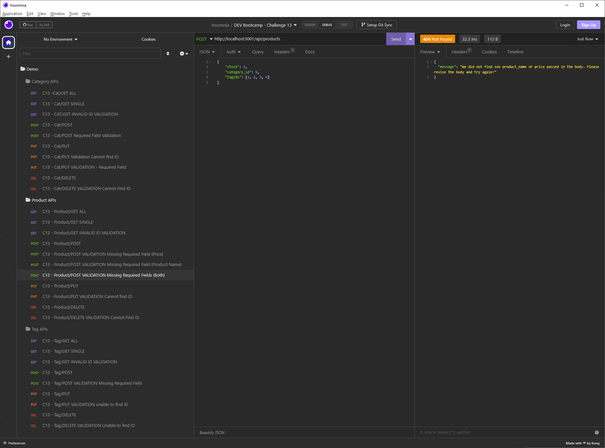

# blue-commerce-systems

## Badges

## Description

- What problem does this application solve?
    - This application helps organizations with the ability to store and organize their product catalogs with basic inventory tracking using RESTFUL APIs.

- What did you learn while working on this?
    - I learned how to interact with a MYSQL database using sequialize.
    - Expanding my ability to provide the user with error handeling on API routes.
    - How to refernace sensative database and information in a .env file.
  
## Table of Contents

 - [Badges](#badges)
 - [Description](#description)
 - [Installation](#installation)
 - [Usage](#usage)
 - [License](#license)
 - [Features](#features)
 - [Questions](#questions)

## Installation
  
Here is some information that you will need to be able to install and properly work this application:
  - Once application has been cloned on the computer install needed npm modules by running 'npm i'.

## Usage
  
Here are some details on how this application can be used:
  - Once application has been cloned and modules installed you can start the server runing node server.js
  - Use insomina or another API application to use API calls to Create, Read, Update, and Delete products in the database.
  - A demo of the application can be viewed here
    - https://garrettwinter.github.io/blue-commerce-systems/public/assets/media/Blue-Commerce-Systems-DEMO.webm
      
Below a screenshot(s) of the application:
  - 
  - 

## License

The MIT license is being used for this application. For more information you can go to the following URL.
  - https://opensource.org/licenses/MIT

## Features

Some of the main features of this application are:
  - API calls to Create, Read, Update, and Delete products in the database.
  - Notication to user when require data is not present in the APIs
  - Notication to user when no data has been changed via the event.